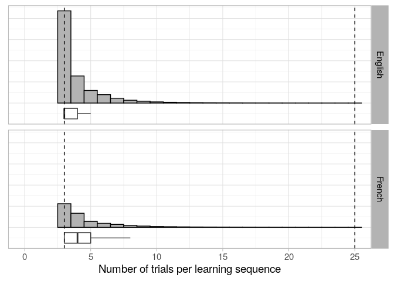
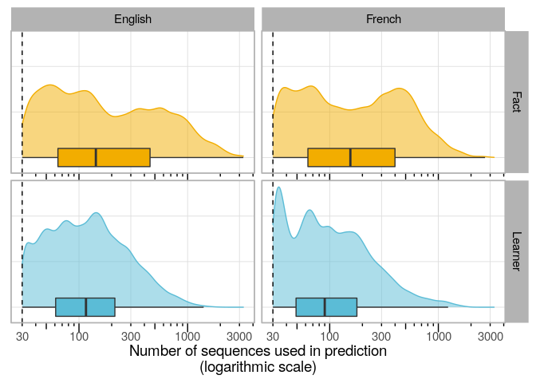

Data statistics
================
Maarten van der Velde
Last updated: 2023-03-04

# Overview

This notebook calculates some useful statistics about the data set.

# Setup

``` r
library(data.table)
library(fst)
library(ggplot2)
library(stringr)

library(wesanderson)


theme_set(theme_light(base_size = 14) +
            theme(strip.text = element_text(colour = "black")))

condition_colours <- wes_palette("Darjeeling1", n = 5)
condition_colours[c(2, 4, 5)] <- condition_colours[c(4, 5, 2)]

# Model priors
mu_0 <- 0.3 # mean (b)
kappa_0 <- 1 # number of observations/precision (c)
a_0 <- 3 # shape of Gamma (g)
b_0 <- 0.2 # rate of Gamma (h)
```

``` r
courses <- c("Grandes Lignes", "Stepping Stones")
```

# Filtering

How much data was discarded due to filtering?

``` r
dat_rof <- data.table()
dat_train <- data.table()
dat_test <- data.table()

for (course in courses) {
  
  rof <- read_fst(file.path("..", "data", paste0("rate_of_forgetting_", str_replace_all(course, " ", "_"), ".fst")))
  setDT(rof)
  dat_rof <- rbind(dat_rof, rof[, course := ifelse(course == "Grandes Lignes", "French", "English")])
  
  rof_sub_train <- read_fst(file.path("..", "data", paste0("training_", str_replace_all(course, " ", "_"), ".fst")))
  rof_sub_test <- read_fst(file.path("..", "data", paste0("testing_", str_replace_all(course, " ", "_"), ".fst")))
  
  setDT(rof_sub_train)
  setDT(rof_sub_test)

  rof_sub_train[, course := ifelse(course == "Grandes Lignes", "French", "English")]
  rof_sub_test[, course := ifelse(course == "Grandes Lignes", "French", "English")]
  
  dat_train <- rbind(dat_train, rof_sub_train)
  dat_test <- rbind(dat_test, rof_sub_test)
  
}

dat_rof <- unique(dat_rof)
dat_train <- unique(dat_train)
dat_test <- unique(dat_test)
```

How many trials do we start with?

``` r
dat_rof[, .(trials = scales::comma(sum(n_reps))), by = .(course)]
```

    ##     course     trials
    ## 1:  French 34,158,787
    ## 2: English 80,845,692

``` r
dat_rof[, under := n_reps < 3, by = .(user_id, fact_id)]
dat_rof[, over := n_reps > 25, by = .(user_id, fact_id)]

dat_rof[, .(n_under = scales::comma(sum(n_reps[under == TRUE])), n_over = scales::comma(sum(n_reps[over == TRUE]))), by = .(course)]
```

    ##     course    n_under    n_over
    ## 1:  French  2,394,514 1,588,624
    ## 2: English 11,537,654 1,302,150

How many trials are
removed?

``` r
dat_rof[under | over, .(trials = scales::comma(sum(n_reps))), by = .(course)]
```

    ##     course     trials
    ## 1:  French  3,983,138
    ## 2: English 12,839,804

What are we left
with?

``` r
dat_rof[!under & !over, .(trials = scales::comma(sum(n_reps))), by = .(course)]
```

    ##     course     trials
    ## 1:  French 30,175,649
    ## 2: English 68,005,888

How many learning sequences is
that?

``` r
dat_rof[!under & !over, .(sequences = scales::comma(.N)), by = .(course)]
```

    ##     course  sequences
    ## 1:  French  6,281,938
    ## 2: English 16,784,808

How many sequences in the test split alone?

``` r
dat_test[, .(sequences = scales::comma(.N)), by = .(course)]
```

    ##     course sequences
    ## 1:  French 1,256,485
    ## 2: English 3,357,209

How many trials in the test split alone?

``` r
dat_test[, .(trials = scales::comma(sum(n_reps))), by = .(course)]
```

    ##     course     trials
    ## 1:  French  6,033,733
    ## 2: English 13,602,025

How many facts and learners in
total?

``` r
dat_rof[!under & !over, .(facts = scales::comma(length(unique(fact_id))),
                          learners = scales::comma(length(unique(user_id)))), by = .(course)]
```

    ##     course  facts learners
    ## 1:  French 27,093   42,489
    ## 2: English 59,416   98,302

How many facts and learners in the test split?

``` r
dat_test[, .(facts = scales::comma(length(unique(fact_id))),
             learners = scales::comma(length(unique(user_id)))), by = .(course)]
```

    ##     course  facts learners
    ## 1:  French 24,647   42,205
    ## 2: English 54,447   96,531

### Number of trials per sequence

We only included sequences consisting of at least 3 trials and at most
25
trials.

``` r
seq_trials <- rbind(dat_train[, .(n_reps, course, set = "Training set")], dat_test[, .(n_reps, course, set = "Test set")])
```

``` r
ggplot(seq_trials, aes(x = n_reps)) +
  facet_grid(course ~ .) +
  geom_histogram(aes(y = ..count.. / sum(..count..)), binwidth = 1, fill = "grey70", colour = "black") +
  geom_boxplot(width = .05, outlier.shape = NA, position = position_nudge(y = -.05)) +
  geom_vline(data = NULL, xintercept = c(3, 25), lty = 2) +
  scale_x_continuous() +
  coord_cartesian(xlim = c(0, 25)) +
  labs(x = "Number of trials per learning sequence",
       y = NULL) +
  guides(fill = "none") +
  theme(axis.ticks.y = element_blank(),
        axis.text.y = element_blank())
```

<!-- -->

``` r
seq_trials[, .(median = median(n_reps), mean = mean(n_reps)), by = .(course)]
```

    ##     course median     mean
    ## 1:  French      4 4.803561
    ## 2: English      3 4.051630

# Number of sequences per prediction

``` r
pred_stats <- data.table()

for (course in courses) {

  fact_pred <- read_fst(file.path("..", "data", "predictions", paste0("pred_v_obs_fact_", str_replace_all(course, " ", "_"), ".fst")))
  setDT(fact_pred)
  
  user_pred <- read_fst(file.path("..", "data", "predictions", paste0("pred_v_obs_user_", str_replace_all(course, " ", "_"), ".fst"))) 
  setDT(user_pred)
  
  setnames(fact_pred, c("fact_id", "pred_fact"), c("id", "pred"))
  fact_pred[, type := "Fact"]
  fact_pred <- unique(fact_pred[, .(id, n_train_obs, type)])
  
  setnames(user_pred, c("user_id", "pred_user"), c("id", "pred"))
  user_pred[, type := "Learner"]
  user_pred <- unique(user_pred[, .(id, n_train_obs, type)])
  
  pred_stats_course <- rbind(fact_pred, user_pred)
  pred_stats_course[, course := ifelse(course == "Grandes Lignes", "French", "English")]
  
  pred_stats <- rbind(pred_stats, pred_stats_course)
}
```

``` r
ggplot(pred_stats, aes(x = n_train_obs)) +
  facet_grid(type ~ course) +
  geom_density(aes(fill = type, colour = type), alpha = .5) +
  geom_boxplot(aes(fill = type), width = .2, position = position_nudge(y = -.0), outlier.shape = NA) +
  geom_vline(data = NULL, xintercept = 30, lty = 2) +
  scale_x_log10() +
  annotation_logticks(sides = "b", outside = T) +
  scale_fill_manual(values = condition_colours[c(3,4)]) +
  scale_colour_manual(values = condition_colours[c(3,4)]) +
  labs(x = "Number of sequences used in prediction\n(logarithmic scale)",
       y = NULL) +
  guides(fill = "none",
         colour = "none") +
  coord_cartesian(clip = "off") +
  theme(axis.ticks.y = element_blank(),
        axis.text.y = element_blank(),
        axis.ticks.x = element_blank(),
        panel.grid.minor = element_blank(),
        axis.text.x = element_text(vjust = 0))
```

<!-- -->

``` r
ggsave(file.path("..", "output", "sequences_per_prediction.png"),
       device = "png", width = 10, height = 4)
```

``` r
pred_stats[, .(q_25 = quantile(n_train_obs, .25), 
               q_50 = quantile(n_train_obs, .5),
               q_75 = quantile(n_train_obs, .75), 
               mean = mean(n_train_obs)),
           by = .(course, type)]
```

    ##     course    type q_25 q_50 q_75     mean
    ## 1:  French    Fact   63  155  399 272.8684
    ## 2:  French Learner   49   90  178 151.1789
    ## 3: English    Fact   64  143  451 335.1628
    ## 4: English Learner   61  116  214 171.9334

Does the number of sequences that went into a prediction affect the
maggnitude of the prediction error?

``` r
pred_v_obs_fact <- data.table()
pred_v_obs_user <- data.table()

for (course in courses) {
  
  pred_fact <- read_fst(file.path("..", "data", "predictions", paste0("pred_v_obs_fact_", str_replace_all(course, " ", "_"), ".fst")))
  pred_user <- read_fst(file.path("..", "data", "predictions", paste0("pred_v_obs_user_", str_replace_all(course, " ", "_"), ".fst")))
  setDT(pred_fact)
  setDT(pred_user)
  
  pred_v_obs_fact <- rbind(pred_v_obs_fact, pred_fact[, course := ifelse(course == "Grandes Lignes", "French", "English")])
  pred_v_obs_user <- rbind(pred_v_obs_user, pred_user[, course := ifelse(course == "Grandes Lignes", "French", "English")])
}

pred_v_obs_fact <- pred_v_obs_fact[!is.na(alpha)]
pred_v_obs_fact <- unique(pred_v_obs_fact)

pred_v_obs_user <- pred_v_obs_user[!is.na(alpha)]
pred_v_obs_user <- unique(pred_v_obs_user)
```

The correlation between the number of training observations and the
absolute prediction error is practically zero (though statistically
significant due to the size of the
data):

``` r
pred_v_obs_fact[, cor.test(n_train_obs, abs(alpha - pred_fact)), by = .(course)]
```

    ##     course statistic parameter      p.value     estimate null.value
    ## 1:  French 41.909300   1231545 0.000000e+00  0.037737732          0
    ## 2:  French 41.909300   1231545 0.000000e+00  0.037737732          0
    ## 3: English -6.305386   3299409 2.875119e-10 -0.003471291          0
    ## 4: English -6.305386   3299409 2.875119e-10 -0.003471291          0
    ##    alternative                               method
    ## 1:   two.sided Pearson's product-moment correlation
    ## 2:   two.sided Pearson's product-moment correlation
    ## 3:   two.sided Pearson's product-moment correlation
    ## 4:   two.sided Pearson's product-moment correlation
    ##                                 data.name     conf.int
    ## 1: n_train_obs and abs(alpha - pred_fact)  0.035974000
    ## 2: n_train_obs and abs(alpha - pred_fact)  0.039501230
    ## 3: n_train_obs and abs(alpha - pred_fact) -0.004550295
    ## 4: n_train_obs and abs(alpha - pred_fact) -0.002392279

``` r
pred_v_obs_user[, cor.test(n_train_obs, abs(alpha - pred_user)), by = .(course)]
```

    ##     course statistic parameter       p.value    estimate null.value
    ## 1:  French -28.31135   1195759 2.866605e-176 -0.02588172          0
    ## 2:  French -28.31135   1195759 2.866605e-176 -0.02588172          0
    ## 3: English  66.35454   3250059  0.000000e+00  0.03678163          0
    ## 4: English  66.35454   3250059  0.000000e+00  0.03678163          0
    ##    alternative                               method
    ## 1:   two.sided Pearson's product-moment correlation
    ## 2:   two.sided Pearson's product-moment correlation
    ## 3:   two.sided Pearson's product-moment correlation
    ## 4:   two.sided Pearson's product-moment correlation
    ##                                 data.name    conf.int
    ## 1: n_train_obs and abs(alpha - pred_user) -0.02767280
    ## 2: n_train_obs and abs(alpha - pred_user) -0.02409048
    ## 3: n_train_obs and abs(alpha - pred_user)  0.03569588
    ## 4: n_train_obs and abs(alpha - pred_user)  0.03786730

Are there just diminishing returns? Then we might see a stronger
correlation on the lower end of the scale. But zooming in on predictions
based on 30 (the minimum) to 100 observations, we still get correlations
close to
zero:

``` r
pred_v_obs_fact[n_train_obs <= 100, cor.test(n_train_obs, abs(alpha - pred_fact)), by = .(course)]
```

    ##     course statistic parameter      p.value     estimate null.value
    ## 1:  French -4.606792    100940 4.094266e-06 -0.014498442          0
    ## 2:  French -4.606792    100940 4.094266e-06 -0.014498442          0
    ## 3: English -3.216643    222570 1.297183e-03 -0.006818039          0
    ## 4: English -3.216643    222570 1.297183e-03 -0.006818039          0
    ##    alternative                               method
    ## 1:   two.sided Pearson's product-moment correlation
    ## 2:   two.sided Pearson's product-moment correlation
    ## 3:   two.sided Pearson's product-moment correlation
    ## 4:   two.sided Pearson's product-moment correlation
    ##                                 data.name     conf.int
    ## 1: n_train_obs and abs(alpha - pred_fact) -0.020665570
    ## 2: n_train_obs and abs(alpha - pred_fact) -0.008330211
    ## 3: n_train_obs and abs(alpha - pred_fact) -0.010972176
    ## 4: n_train_obs and abs(alpha - pred_fact) -0.002663667

``` r
pred_v_obs_user[n_train_obs <= 100, cor.test(n_train_obs, abs(alpha - pred_user)), by = .(course)]
```

    ##     course statistic parameter      p.value     estimate null.value
    ## 1:  French -2.805744    237696 5.020468e-03 -0.005754795          0
    ## 2:  French -2.805744    237696 5.020468e-03 -0.005754795          0
    ## 3: English  9.344159    499976 9.298402e-21  0.013213800          0
    ## 4: English  9.344159    499976 9.298402e-21  0.013213800          0
    ##    alternative                               method
    ## 1:   two.sided Pearson's product-moment correlation
    ## 2:   two.sided Pearson's product-moment correlation
    ## 3:   two.sided Pearson's product-moment correlation
    ## 4:   two.sided Pearson's product-moment correlation
    ##                                 data.name     conf.int
    ## 1: n_train_obs and abs(alpha - pred_user) -0.009774659
    ## 2: n_train_obs and abs(alpha - pred_user) -0.001734746
    ## 3: n_train_obs and abs(alpha - pred_user)  0.010442313
    ## 4: n_train_obs and abs(alpha - pred_user)  0.015985085

# Session info

``` r
sessionInfo()
```

    ## R version 3.6.3 (2020-02-29)
    ## Platform: x86_64-pc-linux-gnu (64-bit)
    ## Running under: Ubuntu 18.04.6 LTS
    ## 
    ## Matrix products: default
    ## BLAS:   /usr/lib/x86_64-linux-gnu/blas/libblas.so.3.7.1
    ## LAPACK: /usr/lib/x86_64-linux-gnu/lapack/liblapack.so.3.7.1
    ## 
    ## locale:
    ##  [1] LC_CTYPE=en_US.UTF-8       LC_NUMERIC=C              
    ##  [3] LC_TIME=nl_NL.UTF-8        LC_COLLATE=en_US.UTF-8    
    ##  [5] LC_MONETARY=nl_NL.UTF-8    LC_MESSAGES=en_US.UTF-8   
    ##  [7] LC_PAPER=nl_NL.UTF-8       LC_NAME=C                 
    ##  [9] LC_ADDRESS=C               LC_TELEPHONE=C            
    ## [11] LC_MEASUREMENT=nl_NL.UTF-8 LC_IDENTIFICATION=C       
    ## 
    ## attached base packages:
    ## [1] stats     graphics  grDevices utils     datasets  methods   base     
    ## 
    ## other attached packages:
    ## [1] wesanderson_0.3.6 stringr_1.4.0     ggplot2_3.3.5     fst_0.9.0        
    ## [5] data.table_1.13.6
    ## 
    ## loaded via a namespace (and not attached):
    ##  [1] Rcpp_1.0.6       pillar_1.6.3     compiler_3.6.3   tools_3.6.3     
    ##  [5] digest_0.6.19    jsonlite_1.6     evaluate_0.14    lifecycle_1.0.1 
    ##  [9] tibble_2.1.3     gtable_0.3.0     pkgconfig_2.0.2  rlang_0.4.10    
    ## [13] DBI_1.1.0        yaml_2.2.0       parallel_3.6.3   xfun_0.21       
    ## [17] withr_2.3.0      dplyr_1.0.7      knitr_1.23       generics_0.1.0  
    ## [21] vctrs_0.3.8      grid_3.6.3       tidyselect_1.1.1 glue_1.4.2      
    ## [25] R6_2.4.0         fansi_0.4.0      rmarkdown_2.6    farver_2.1.0    
    ## [29] purrr_0.3.2      magrittr_2.0.1   scales_1.1.1     htmltools_0.3.6 
    ## [33] ellipsis_0.3.2   colorspace_1.4-1 labeling_0.3     utf8_1.1.4      
    ## [37] stringi_1.4.3    munsell_0.5.0    crayon_1.4.1
